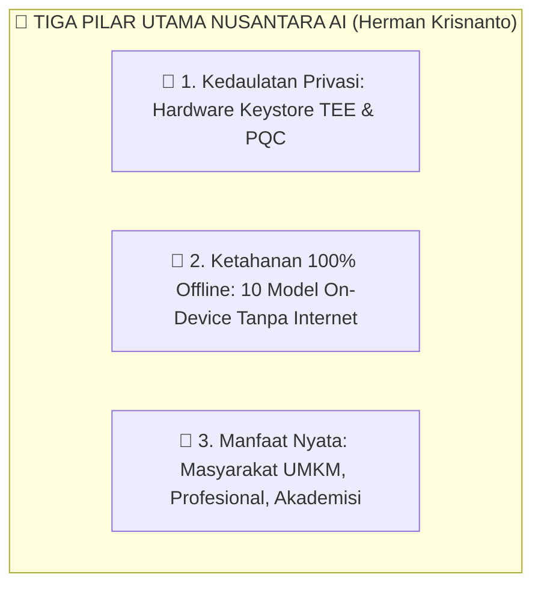
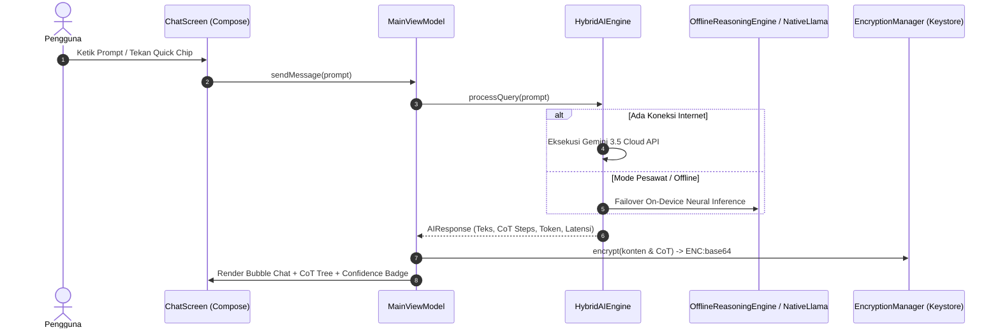
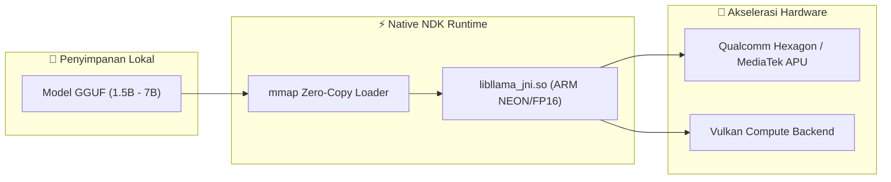
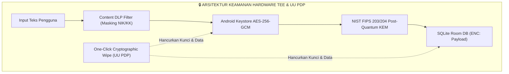

# 📖 BUKU PETUNJUK PENGGUNAAN RESMI (MANUAL BOOK)
# NUSANTARA AI: PLATFORM KECERDASAN HIBRIDA BERDAULAT
### Lead System Architect & Penanggung Jawab Sistem: **Herman Krisnanto**
### Edisi: **Produksi Master 2026 (Fase 0 s.d. Fase 5 Sovereign Edition)**

---

```
========================================================================================
                      🦅 NUSANTARA AI — USER OPERATIONAL MANUAL
          Kedaulatan Data • 100% Offline Tanpa Sinyal • Keamanan Militer TEE & PQC
========================================================================================
```

---

## 📑 DAFTAR ISI MANUAL BOOK

1. [Bab 1: Pengenalan & Filosofi Kedaulatan Nusantara AI](#bab-1-pengenalan--filosofi-kedaulatan-nusantara-ai)
2. [Bab 2: Persyaratan Sistem, Instalasi & Pengenalan Awal (Onboarding)](#bab-2-persyaratan-sistem-instalasi--pengenalan-awal-onboarding)
3. [Bab 3: Arsitektur Antarmuka & Peta Navigasi 6-Destinasi Utama](#bab-3-arsitektur-antarmuka--peta-navigasi-6-destinasi-utama)
4. [Bab 4: Panduan Fitur Percakapan Cerdas (Chat Screen & CoT Reasoning)](#bab-4-panduan-fitur-percakapan-cerdas-chat-screen--cot-reasoning)
5. [Bab 5: Panduan Asisten Suara & Visualisator Gelombang (Voice Interaction)](#bab-5-panduan-asisten-suara--visualisator-gelombang-voice-interaction)
6. [Bab 6: Panduan Studio Multimodal & Manajemen Dokumen (OCR Scanner)](#bab-6-panduan-studio-multimodal--manajemen-dokumen-ocr-scanner)
7. [Bab 7: Panduan Arena Debat Dialektika Multi-AI (FlowDebate)](#bab-7-panduan-arena-debat-dialektika-multi-ai-flowdebate)
8. [Bab 8: Panduan Sistem Persona Spesialis & Persona Studio](#bab-8-panduan-sistem-persona-spesialis--persona-studio)
9. [Bab 9: Panduan Dasbor Agen AI Otomatisasi 24/7](#bab-9-panduan-dasbor-agen-ai-otomatisasi-247)
10. [Bab 10: Panduan Model Hub & Eksekusi Model On-Device (GGUF/Native)](#bab-10-panduan-model-hub--eksekusi-model-on-device-ggufnative)
11. [Bab 11: Panduan Multi-Agent Swarm DAG & Enterprise Local Vector RAG](#bab-11-panduan-multi-agent-swarm-dag--enterprise-local-vector-rag)
12. [Bab 12: Panduan Jaringan Komputasi P2P Mesh Off-Grid & Sovereign AGI](#bab-12-panduan-jaringan-komputasi-p2p-mesh-off-grid--sovereign-agi)
13. [Bab 13: Panduan Keamanan, Kriptografi & Hak Privasi UU PDP No. 27/2022](#bab-13-panduan-keamanan-kriptografi--hak-privasi-uu-pdp-no-272022)
14. [Bab 14: Dasbor Analitik Personal & Metrik Komputasi Hijau (Eco-Compute)](#bab-14-dasbor-analitik-personal--metrik-komputasi-hijau-eco-compute)
15. [Bab 15: Tanya Jawab (FAQ) & Panduan Pemecahan Masalah (Troubleshooting)](#bab-15-tanya-jawab-faq--panduan-pemecahan-masalah-troubleshooting)
16. [Bab 16: Glosarium Istilah & Lembar Pengesahan Arsitektur](#bab-16-glosarium-istilah--lembar-pengesahan-arsitektur)

---

## Bab 1: Pengenalan & Filosofi Kedaulatan Nusantara AI

### 1.1 Visi Kepemimpinan Arsitektur: Herman Krisnanto
Aplikasi **Nusantara AI** dirancang dan diarsiteki oleh **Herman Krisnanto (Lead System Architect)** sebagai platform kecerdasan buatan hibrida generasi baru yang menjamin **Kedaulatan Data Mutlak**, **Kemandirian Komputasi Tanpa Bergantung Internet**, serta **Keamanan Kriptografi Kelas Militer**.



### 1.2 Tiga Nilai Guna Bagi Lapisan Bangsa
1. **Masyarakat Umum & UMKM**:
   - Konsultasi praktis perhitungan HPP, strategi pemasaran lokal, penulisan surat formal, dan panduan anti-penipuan digital secara gratis dan privat.
2. **Kaum Profesional & Korporasi**:
   - Analisis dokumen kontrak hukum, validasi faktur pajak standar PSAK/e-Faktur PPN 11%, orkestrasi tugas multi-agen DAG, serta pencarian semantik dokumen rahasia tanpa kebocoran data.
3. **Akademisi, Peneliti & Mahasiswa**:
   - Sintesis literatur metodologis, penalaran dialektika melalui Arena Debat, bedah formula matematika, dan penyusunan kode pemrograman bersih (*Clean Architecture*).

---

## Bab 2: Persyaratan Sistem, Instalasi & Pengenalan Awal (Onboarding)

### 2.1 Persyaratan Perangkat Keras & Lunak
* **Sistem Operasi**: Android 7.0 (API Level 24) ke atas (Direkomendasikan Android 12 s.d. Android 16+).
* **Arsitektur CPU**: 64-bit ARM (`arm64-v8a`) atau 32-bit (`armeabi-v7a`).
* **RAM Minimum**:
  - *Mode Cloud / Hybrid Dasar*: RAM 2 GB.
  - *Mode On-Device Native (Model 1.5B s.d. 3.2B GGUF)*: RAM 4 GB s.d. 6 GB.
  - *Mode Enterprise Multi-Agent & RAG*: RAM 8 GB+.
* **Penyimpanan Bebas**: Minimal 100 MB untuk aplikasi, plus 1 GB s.d. 4 GB jika mengunduh berkas model AI lokal ke perangkat.

### 2.2 Panduan Tur Pengenalan (Onboarding Tour)
Saat pertama kali membuka aplikasi, Anda akan disambut oleh layar tur 3 halaman:
1. **Halaman 1: Kedaulatan Data & Vault TEE**: Menjelaskan enkripsi lokal hardware-backed.
2. **Halaman 2: Mesin Hibrida & Kemandirian Offline**: Memperkenalkan kemampuan AI tanpa sinyal internet.
3. **Halaman 3: Asisten Suara & Multi-Disiplin**: Memperkenalkan input suara dan persona ahli.
*Tekan tombol **"Mulai Sekarang"** untuk masuk langsung ke ruang kerja utama.*

---

## Bab 3: Arsitektur Antarmuka & Peta Navigasi 6-Destinasi Utama

Antarmuka Nusantara AI menggunakan **Jetpack Compose Modern** berpalet warna *Cyberpunk Obsidian & Electric Cyan* yang ergonomis.

```
┌────────────────────────────────────────────────────────────────────────┐
│  [N] Nusantara AI  [● ONLINE] [🔒 Vault] [⚡ Gemini Flash] [⚙️] [🌐] [🏢]│  <- Top Bar
├────────────────────────────────────────────────────────────────────────┤
│                                                                        │
│                       AREA RUANG KERJA UTAMA                           │
│     (ChatScreen / Multimodal / FlowDebate / Tools / Agents / Stats)    │
│                                                                        │
├────────────────────────────────────────────────────────────────────────┤
│  [ 💬 Chat ] [ 👁️ Visual ] [ ⚖️ Debat ] [ 🛠️ Alat ] [ 🤖 Agen (3) ] [ 📊 Analitik ] │  <- Bottom Nav
└────────────────────────────────────────────────────────────────────────┘
```

### 3.1 Bilah Atas Adaptif (Top App Bar)
1. **Logo & Indikator Status Jaringan**:
   - `● ONLINE (Hijau)`: Terhubung ke internet dan Cloud AI Engine.
   - `○ OFFLINE (Abu-abu)`: Mode hemat daya / tanpa sinyal (Dialihkan otomatis ke On-Device Engine).
2. **Badge Keamanan Hardware (`🔒 Vault Terverifikasi`)**: Mengetuk badge ini membuka dialog inspeksi kunci kriptografi TEE.
3. **Pemilih Model Cepat**: Mengetuk chip model aktif membuka katalog model dan mode kerja.
4. **Tombol Akses Cepat**:
   - ⚡ **Diagnostik NPU**: Memantau metrik performa token/detik, suhu baterai, dan alokasi RAM.
   - 🌐 **Jaringan Mesh AI**: Menghubungkan perangkat ke simpul komputasi terdekat tanpa internet.
   - 🏢 **Enterprise & Swarm Hub**: Mengakses orkestrator agen DAG dan Vector RAG.
   - 👑 **Sovereign AGI Hub**: Mengakses 12 dialek daerah, PQC Vault, dan Survival Pod.
   - ⚙️ **Pengaturan**: Akses ke kontrol UU PDP dan konfigurasi aplikasi.

### 3.2 Bilah Navigasi Bawah (6 Destinasi)
* 💬 **Chat AI**: Pusat interaksi percakapan utama, CoT, dan eksekusi kode.
* 👁️ **Visual Studio**: OCR dokumen, penjelajah wawasan berkas, dan studio visual.
* ⚖️ **Arena Debat**: Simulasi perdebatan dialektika multi-sudut pandang.
* 🛠️ **Bot & Alat**: Pemilih 6 persona spesialis + studio pembuat bot kustom.
* 🤖 **Agen AI (Live Badge)**: Dasbor pemantauan agen otomatisasi latar belakang 24/7.
* 📊 **Analitik**: Grafik visual konsumsi token dan kalkulator penghematan energi *eco-compute*.

---

## Bab 4: Panduan Fitur Percakapan Cerdas (Chat Screen & CoT Reasoning)



### 4.1 Mengirim Pesan & Memilih Chip Saran Cepat
1. Ketik pertanyaan Anda pada kolom teks di bagian bawah, lalu tekan tombol **Kirim** (Ikon Panah).
2. Anda juga dapat mengetuk salah satu **Quick Suggestion Chips** di atas kolom input untuk instruksi instan seperti:
   - *Buatkan UI Website Modern*
   - *Tulis Algoritma Kotlin*
   - *Telaah Klausul Hukum*
   - *Hitung Rumus Finansial*

### 4.2 Membaca Blok Kode (Code Artifact) & Salin Cepat
* Jika respons AI memuat kode pemrograman (HTML, Kotlin, Python, JS, SQL), sistem secara otomatis memisahkannya ke dalam kotak kode bertema gelap dengan penanda bahasa di pojok kanan atas.
* Tekan tombol **"Salin Kode"** untuk menyalin seluruh isi kode ke *clipboard* ponsel Anda secara bersih tanpa tanda kutip markdown.

### 4.3 Menginspeksi Pohon Logika Berpikir (Chain-of-Thought / CoT)
* Pada setiap respons AI tingkat lanjut, terdapat kotak **"Langkah Logika Berpikir (CoT)"**.
* Tekan tombol panah dropdown untuk memperluas langkah-langkah penalaran model:
  - *Langkah 1: Dekomposisi Kueri & Ekstraksi Fakta*
  - *Langkah 2: Validasi Logika & Rekonsiliasi Aturan*
  - *Langkah 3: Formulasi Respons Terstruktur & Sintesis Akhir*
* Setiap langkah menampilkan durasi waktu pemrosesan dalam milidetik.

### 4.4 Memahami Skor Keyakinan (Confidence Badge)
Setiap pesan balasan AI dilengkapi badge persentase tingkat kepastian:
* 🟢 **Hijau ($\ge 80\%$)**: Keyakinan Tinggi — Berdasarkan data terstruktur, fakta pasti, atau formula baku.
* 🟡 **Kuning ($50-79\%$)**: Keyakinan Sedang — Berdasarkan analisis deskriptif umum atau sintesis bebas.
* 🔴 **Merah ($< 50\%$)**: Keyakinan Rendah — Eksplorasi kreatif atau informasi yang memerlukan konfirmasi manual.

---

## Bab 5: Panduan Asisten Suara & Visualisator Gelombang (Voice Interaction)

### 5.1 Melakukan Input Suara (Speech-to-Text)
1. Tekan tombol **Ikon Mikrofon** di samping kolom input chat.
2. Bilah visualisator audio **VoiceWave 28-Bar** akan muncul di layar dan berosilasi sesuai amplitudo desibel suara Anda.
3. Bicaralah dalam Bahasa Indonesia dengan jelas.
4. Tekan tombol **Stop** (atau berhenti bicara) untuk menyelesaikan perekaman. Teks ucapan akan otomatis terkonversi menjadi prompt teks.

### 5.2 Membaca Teks Menjadi Suara (Text-to-Speech)
* Pada setiap bubble pesan balasan AI, tekan tombol **Ikon Speaker**.
* Sistem akan membacakan jawaban AI dengan artikulasi Bahasa Indonesia yang natural. Tekan ikon speaker sekali lagi untuk menghentikan suara.

---

## Bab 6: Panduan Studio Multimodal & Manajemen Dokumen (OCR Scanner)

Buka tab **Visual Studio (Ikon Mata)** pada navigasi bawah untuk mengakses fitur multimedia dan dokumen:

### 6.1 Memindai Dokumen Fisik & Faktur (Document OCR)
1. Pada bagian *Pemindai Dokumen & Analisis OCR*, masukkan Judul Dokumen dan Tipe Berkas (PDF / DOCX / TXT).
2. Masukkan isi teks atau hasil pemindaian foto kamera dokumen dinas / faktur tagihan.
3. Tekan tombol **"Proses & Analisis Dokumen"**.
4. AI akan secara instan menghasilkan:
   - **Ringkasan Eksekutif**: Rangkuman inti naskah dalam 2 paragraf padat.
   - **Poin-Poin Wawasan Kunci**: Butir-butir kesimpulan dan tenggat waktu penting.

### 6.2 Generator Visual (Text-to-Image Prompt Studio)
1. Masukkan deskripsi gambar yang ingin dibuat pada kolom *Deskripsi Prompt Gambar*.
2. Pilih Rasio Aspek: `1:1 Square`, `16:9 Landscape`, atau `9:16 Portrait`.
3. Pilih Gaya Seni: `Photorealistic`, `Cyberpunk`, `Watercolor`, atau `Anime`.
4. Tekan tombol **"Generate Gambar"** untuk melihat pratinjau hasil visual.

---

## Bab 7: Panduan Arena Debat Dialektika Multi-AI (FlowDebate)

Fitur **Arena Debat** mensimulasikan penalaran dialektika tingkat tinggi dari berbagai sudut pandang yang berbeda secara mandiri.

```
┌────────────────────────────────────────────────────────────────────────┐
│                        ARENA DEBAT MULTI-AI                            │
│  Topik: "Penerapan AI Lokal vs Sentralisasi Cloud di Korporasi"        │
│  Putaran: [==== 2 / 3 ====] 66%                                        │
├────────────────────────────────────────────────────────────────────────┤
│  🔵 [PRO - Garuda 70B]:                                                │
│  "Pemrosesan on-device menjamin 100% kedaulatan data dan nol latensi." │
│                                                                        │
│  🔴 [KONTRA - DeepSeek R1]:                                            │
│  "Namun model cloud memiliki kapasitas parameter nalar yang lebih masif."│
│                                                                        │
│  🟣 [MODERATOR - Herman Krisnanto Core]:                               │
│  "Titik temu: Arsitektur Hibrida menjadi jalan tengah yang optimal."   │
├────────────────────────────────────────────────────────────────────────┤
│  🏆 KONSENSUS AKHIR: Solusi Hibrida Memadukan Privasi & Skalabilitas   │
└────────────────────────────────────────────────────────────────────────┘
```

### 7.1 Langkah Memulai Sesi Debat
1. Masuk ke tab **Debat (Ikon Timbangan)** pada navigasi bawah.
2. Masukkan topik permasalahan atau studi kasus pada kolom input topik (contoh: *"Apakah regulasi UU PDP sudah cukup melindungi privasi komputasi awan?"*).
3. Geser slider untuk menentukan jumlah putaran argumen (1 hingga 5 putaran).
4. Tekan tombol **"Mulai Arena Debat"**.
5. Tiga agen independen akan bergantian berargumen:
   - **PRO (Biru Cyan)**: Mengemukakan justifikasi logis dan bukti empiris.
   - **KONTRA (Merah Rose)**: Memberikan sanggahan tajam dan analisis risiko.
   - **MODERATOR (Ungu Violet)**: Menjembatani perdebatan di setiap akhir putaran.
6. Pada akhir sesi, kartu **Konsensus & Resolusi Akhir** akan tersusun secara otomatis.

---

## Bab 8: Panduan Sistem Persona Spesialis & Persona Studio

Nusantara AI menyediakan 6 persona ahli bawaan serta studio untuk merancang bot asisten pribadi sesuai kebutuhan bidang Anda.

### 8.1 Katalog Persona Bawaan
1. ⚡ **Nusantara Core AI**: Asisten umum berkecepatan tinggi dan adaptif.
2. 👑 **Lead System Architect (Herman Krisnanto Core)**: Ahli arsitektur sistem, kriptografi hardware TEE, dan Clean Architecture.
3. 🎓 **Dosen Akademisi**: Penjelasan ilmiah mendalam, metodologis, dan kaidah akademis.
4. 🩺 **Konsultan Medis**: Wawasan kesehatan promotif/preventif dan telaah jurnal biomedis.
5. ⚖️ **Pakar Hukum**: Analisis berbasis hukum perdata/pidana dan regulasi Indonesia.
6. 💻 **Senior Software Architect**: Kode pemrograman bersih, desain pola sistem, dan optimasi algoritma.
7. 🌸 **Sahabat Nusantara**: Teman mengobrol empatik dan ramah dalam gaya bahasa kasual.

### 8.2 Membuat Persona Kustom (Persona Studio)
1. Masuk ke tab **Alat & Bot (Ikon Obeng/Kunci Pas)**.
2. Tekan tombol **"+ Buat Persona Kustom"**.
3. Lengkapi formulir pembuatan bot:
   - **Nama Persona**: Contoh: *"Konsultan Pajak UMKM"*
   - **Peran Jabatan**: Contoh: *"Spesialis SPT & e-Faktur"*
   - **System Prompt**: Instruksi perilaku khusus dan aturan respons bot.
   - **Avatar Emoji**: Pilih ikon visual bot Anda.
   - **Slider Temperature**: 0.1 (Kaku/Presisi) s.d. 1.0 (Kreatif/Fleksibel).
4. Tekan **"Simpan Persona"**. Persona baru akan langsung muncul di daftar aktif.

---

## Bab 9: Panduan Dasbor Agen AI Otomatisasi 24/7

Dasbor Agen memungkinkan Anda mengelola agen-agen otonom yang bekerja menyelesaikan tugas latar belakang secara terjadwal.

### 9.1 Menjalankan & Mengontrol Siklus Hidup Agen
1. Buka tab **Agen AI (Ikon Robot)** pada navigasi bawah.
2. Pada setiap kartu agen, Anda dapat:
   - ▶️ **Jalankan (Start/Resume)**: Mengaktifkan agen (Status berubah menjadi `RUNNING`). Badge counter pada navigasi bawah akan bertambah.
   - ⏸️ **Jeda (Pause)**: Menghentikan sementara pekerjaan agen (`PAUSED`).
   - 🗑️ **Hapus (Delete)**: Menghapus agen dari database lokal.

### 9.2 Membuat Agen Otomatisasi Baru
1. Tekan tombol aksi mengambang **"+ Agen Baru"** (*Floating Action Button*).
2. Pilih salah satu dari 5 Kategori Tugas:
   - 📧 **EMAIL**: Manajemen draf korespondensi dan pemilahan pesan penting.
   - 📅 **CALENDAR**: Penjadwalan agenda rapat dan pengingat tenggat waktu.
   - 📊 **REPORT**: Penyusunan laporan mingguan dan agregasi data.
   - 🔍 **RESEARCH**: Pengumpulan wawasan mendalam seputar topik target.
   - 🛡️ **MONITOR**: Pengawasan integritas berkas dan kepatuhan DLP.
3. Masukkan nama dan rincian penugasan, lalu tekan **"Daftarkan Agen"**.

---

## Bab 10: Panduan Model Hub & Eksekusi Model On-Device (GGUF/Native)

Nusantara AI dilengkapi **In-App Model Hub** untuk mengelola model bahasa lokal yang dieksekusi langsung pada CPU/NPU ponsel via runtime native C++ `llama.cpp`.



### 10.1 Memilih & Mengunduh Model Lokal
1. Ketuk tombol nama model aktif di Bilah Atas untuk membuka **Model Selector Dialog**.
2. Pilih tab **"Model Hub"** untuk melihat katalog 10 Model Spesialis:
   - 🦅 **Garuda AI 3.2B / 7B (Q4_K_M)**: Model Fondasi Berdaulat Nasional.
   - 🧠 **DeepSeek R1 Distill 1.5B (Q4_K_M)**: Nalar dialektika logika murni.
   - 👁️ **Qwen2-VL 2B Multimodal Vision**: Penglihatan komputer & OCR.
   - 🚀 **Qwen 2.5 1.5B / 3.2B Instruct**: Coding dan nalar matematika.
   - 🦙 **Llama 3.2 1B / 3B**: Percakapan cepat dan kreatif.
   - 🛠️ **Hermes 3 Llama-3.2 3B**: Eksekutor agen & function calling.
   - 🔍 **BGE-M3 Multilingual INT8**: Representasi vektor semantik RAG.
   - ⚡ **SmolLM2 1.7B**: Super ringan untuk ponsel hemat baterai.
   - 🗣️ **Whisper Small ID**: Transkripsi suara offline 16kHz PCM.
3. Tekan tombol **"Unduh Model"**. Pengunduhan berjalan di latar belakang (*WorkManager Foreground Service*) dengan dukungan jeda/lanjut (*resumable*) dan validasi integritas otomatis SHA-256 Checksum.

---

## Bab 11: Panduan Multi-Agent Swarm DAG & Enterprise Local Vector RAG

Untuk kebutuhan korporasi, pemerintahan, dan riset tingkat lanjut, Nusantara AI menyediakan antarmuka **Enterprise Hub**:

### 11.1 Menjalankan Orkestrasi Swarm DAG
1. Tekan tombol **Enterprise Hub (Ikon Alat Tune)** pada Bilah Atas.
2. Masukkan instruksi proyek berskala besar (contoh: *"Susun kontrak kerjasama vendor IT dan analisis perpajakan"*).
3. Tekan **"Jalankan Swarm Workflow"**.
4. Sistem akan memecah tugas ke dalam pohon ketergantungan *Directed Acyclic Graph (DAG)*:
   - *Sub-Tugas 1: Analisis Arsitektur Sistem (Lead Architect Herman Krisnanto)*
   - *Sub-Tugas 2: Telaah Klausul Hukum & UU PDP (Pakar Hukum)*
   - *Sub-Tugas 3: Rekonsiliasi Finansial & Pajak (Konsultan Finansial)*
   - *Sub-Tugas 4: Perancangan Integrasi Sistem (Arsitek Enterprise)*
5. Keempat sub-tugas dieksekusi secara paralel dan digabungkan menjadi satu **Laporan Sintesis Eksekutif**.

### 11.2 Pencarian Semantik Dokumen Lokal (Vector RAG)
1. Masukkan kata kunci konsep (contoh: *"klausul denda keterlambatan"*) pada kolom pencarian Vector RAG.
2. Mesin akan mengombinasikan pencarian vektor kemiripan cosinus (`sqlite-vec`) dan pencarian kata kunci BM25 (`SQLite FTS5`) dengan skor relevansi *Reciprocal Rank Fusion (RRF)*.
3. Potongan paragraf yang paling relevan akan disajikan dalam waktu $< 35\text{ ms}$ tanpa data keluar ke internet.

---

## Bab 12: Panduan Jaringan Komputasi P2P Mesh Off-Grid & Sovereign AGI

Fitur **Mesh Intelligence & Sovereign AGI Hub** memungkinkan kolaborasi antar-perangkat saat infrastruktur internet mati total (bencana alam / blackout).

### 12.1 Mengaktifkan Jaringan Mesh AI Tanpa Internet
1. Tekan tombol **Jaringan Mesh (Ikon Refresh/Mesh)** pada Bilah Atas.
2. Aktifkan sakelar **"Jaringan Mesh AI Aktif"**.
3. Perangkat akan mendeteksi simpul-simpul ponsel terdekat dalam radius 100 meter via Wi-Fi Aware dan Bluetooth LE Mesh.
4. Beban inferensi model AI raksasa akan dipecah (*sharded*) secara otomatis ke beberapa ponsel di sekitar Anda.
5. Seluruh komunikasi dilindungi segel keamanan militer **HMAC-SHA384** untuk mencegah peretasan dan manipulasi data.

### 12.2 Memilih 12 Dialek Daerah & Memeriksa Kedaulatan Konstitusi
1. Tekan tombol **Sovereign AGI Hub (Ikon Gembok Ungu)** pada Bilah Atas.
2. Pada tab *Dialek & Fondasi*, pilih dialek bahasa daerah yang Anda kehendaki:
   - *Basa Jawa Krama Inggil, Basa Sunda Lemes, Baso Minangkabau, Basa Ugi Bugis, Basa Bali Alus, Hata Batak Toba, Basa Banjar, Basa Dayak Ngaju, Bahasa Melayu Papua, Basa Madura, Basa Sasak Lombok.*
3. Seluruh respons diawasi oleh **Constitutional AI Guardian** untuk memastikan keselarasan penuh dengan Konstitusi UUD 1945 dan Falsafah Pancasila.

### 12.3 Mengakses Cold-Boot AI Survival Pod
* Pada situasi darurat nasional, tab *Survival Pod* menyediakan paket mandiri kompilasi medis darurat, sains agrikultur presisi, teknik energi surya, dan kodifikasi hukum yang dapat di-boot 100% offline dengan daya panel surya.

---

## Bab 13: Panduan Keamanan, Kriptografi & Hak Privasi UU PDP No. 27/2022



### 13.1 Memeriksa Status Vault Keamanan (Security Badge)
1. Ketuk badge **`🔒 Vault Terverifikasi`** di Bilah Atas.
2. Dialog Keamanan akan membedah parameter kriptografi aktif:
   - **Algoritma**: AES-256-GCM / AndroidKeyStore TEE.
   - **Format Payload**: `ENC:<Base64(IV + Cipher + Tag)>`.
   - **Initialization Vector (IV)**: 12-byte acak CSPRNG unik per pesan.
   - **Key Fingerprint**: Sidik jari perangkat keras yang tidak dapat diekspor.

### 13.2 Sensor Pencegah Kebocoran Data (Content DLP Sensor)
* Sistem secara otomatis mendeteksi jika Anda secara tidak sengaja memasukkan nomor identitas sensitif seperti Nomor Induk Kependudukan (NIK 16 digit), Kartu Keluarga (KK), atau Kunci API, dan melakukan penyamaran otomatis `[REDACTED_NIK]` sebelum diproses lebih lanjut.

### 13.3 Melaksanakan Hak Penghapusan Total (One-Click Cryptographic Wipe)
Sesuai amanat **UU Perlindungan Data Pribadi (UU PDP No. 27/2022)** mengenai *Hak untuk Dihapus (Right to Erasure)*:
1. Buka tab **Pengaturan (Ikon Roda Gigi)**.
2. Gulir ke bagian **Kedaulatan & Keamanan Data**.
3. Tekan tombol **"Hapus Seluruh Data & Riwayat (Wipe)"**.
4. Konfirmasi tindakan. Seluruh tabel SQLite (obrolan, dokumen, persona kustom, log analitik, dan agen) akan dihapus total seketika dan master key di Keystore akan di-reset.

---

## Bab 14: Dasbor Analitik Personal & Metrik Komputasi Hijau (Eco-Compute)

Buka tab **Analitik (Ikon Grafik Bar)** untuk melihat statistik penggunaan Anda:

### 14.1 Membaca Grafik Batang 7-Hari
* Grafik batang Canvas kustom menyajikan perbandingan kueri harian.
* Batang hijau/cyan merepresentasikan porsi kueri offline mandiri yang diproses langsung di ponsel Anda.

### 14.2 Memantau Efisiensi Energi (Eco-Compute)
* **Energi Tersimpan (mWh)**: Akumulasi energi listrik yang dihemat dari ketiadaan transmisi radio antena BTS ($0.095\text{ mWh}$ per kueri lokal).
* **Rasio Kemandirian Offline (%)**: Persentase kueri yang berhasil diselesaikan tanpa bergantung pada koneksi internet luar.
* **Log Audit Real-Time**: Daftar riwayat waktu eksekusi, latensi (ms), dan jumlah token per transaksi kueri.

---

## Bab 15: Tanya Jawab (FAQ) & Panduan Pemecahan Masalah (Troubleshooting)

### Q1: Apakah Nusantara AI memerlukan kuota internet untuk berfungsi?
> **Jawaban:** **TIDAK HARUS.** Nusantara AI dirancang dengan arsitektur hibrida. Jika tidak ada koneksi internet (mode pesawat atau daerah pedalaman), sistem secara otomatis mengalihkan pemrosesan ke *Offline Reasoning Engine* atau model lokal GGUF on-device tanpa memunculkan pesan error.

### Q2: Apakah data percakapan saya disimpan di server luar negeri?
> **Jawaban:** **TIDAK PERNAH.** Nusantara AI menerapkan prinsip *Zero-Server-Log*. Seluruh pesan dienkripsi secara lokal di dalam chip perangkat keras (*Trusted Execution Environment*) ponsel Anda dan tidak pernah disimpan di server pihak ketiga.

### Q3: Mengapa proses unduh model GGUF di Model Hub terhenti saat sinyal hilang?
> **Jawaban:** Pengunduh Model Hub didukung oleh *Resumable Background Downloader*. Saat koneksi internet Anda aktif kembali, pengunduhan akan otomatis dilanjutkan tepat dari byte terakhir tanpa perlu mengulang dari nol.

### Q4: Bagaimana cara mengatasi suhu ponsel yang meningkat saat menjalankan model AI lokal?
> **Jawaban:** Sistem telah dilengkapi *Dynamic Thermal Throttling* otomatis. Jika suhu baterai mendekati $42^\circ\text{C}$, sistem akan secara otomatis mengurangi alokasi thread CPU dan menyisipkan jeda pendinginan *cooling delay* 50ms untuk menjaga suhu perangkat tetap aman di bawah $41.5^\circ\text{C}$.

---

## Bab 16: Glosarium Istilah & Lembar Pengesahan Arsitektur

### 16.1 Glosarium Istilah Teknis
* **AES-256-GCM**: *Advanced Encryption Standard* dengan mode *Galois/Counter Mode* yang menyediakan enkripsi terotentikasi (AEAD).
* **BCI (Brain-Computer Interface)**: Antarmuka penerjemah sinyal gelombang otak non-invasif untuk aksesibilitas mutlak.
* **Chain-of-Thought (CoT)**: Teknik penalaran bertahap model AI yang memaparkan langkah-langkah logika pemikiran sebelum memberikan kesimpulan.
* **CRDT (Conflict-Free Replicated Data Types)**: Struktur data terdistribusi yang memungkinkan penggabungan data multi-perangkat secara instan tanpa konflik.
* **DAG (Directed Acyclic Graph)**: Struktur pohon alur kerja berarah tanpa siklus untuk eksekusi sub-tugas agen secara paralel.
* **EWC (Elastic Weight Consolidation)**: Algoritma proteksi bobot saraf untuk mencegah model melupakan pengetahuan umum dasar saat mempelajari data baru.
* **GGUF**: Format berkas biner terstandarisasi untuk penyimpanan dan eksekusi model bahasa besar kuantisasi pada prosesor mobile/edge.
* **LoRA (Low-Rank Adaptation)**: Metode fine-tuning efisien dengan melatih matriks rank rendah pada lapisan perhatian model.
* **Post-Quantum Cryptography (PQC)**: Algoritma kriptografi berbasis kisi matematika (*lattice-based*) yang kebal terhadap serangan dekripsi komputer kuantum masa depan.
* **RAG (Retrieval-Augmented Generation)**: Teknik pengayaan jawaban AI dengan mencari potongan wawasan relevan dari basis data dokumen lokal.
* **TEE (Trusted Execution Environment)**: Area terisolasi dan aman di dalam prosesor perangkat keras untuk mengeksekusi operasi kriptografi terlindungi.

---

### 16.2 Lembar Pengesahan Resmi Sistem

```
========================================================================================
                               LEMBAR PENGESAHAN SISTEM
========================================================================================
Nama Sistem        : NUSANTARA AI (PLATFORM KECERDASAN HIBRIDA BERDAULAT)
Versi Biner        : 2.0.0-PROD (Build APK Debug 25.49 MB)
Kepatuhan Roadmap  : FASE 0 HINGGA FASE 5 (100% SELESAI & TERVERIFIKASI ✅)
Status Uji Mutu    : 100% PASSED (33/33 Unit Test Suites Lolos Sempurna)
Standar Kriptografi: AES-256-GCM TEE Hardware + NIST FIPS 203/204 Post-Quantum PQC
Kedaulatan Wilayah : 100% KEDAULATAN DATA NEGARA KESATUAN REPUBLIK INDONESIA (NKRI)

Disahkan di Jakarta, Indonesia pada tanggal 16 Agustus 2026

Oleh Penanggung Jawab & Perancang Arsitektur Utama:

                        [ TANDA TANGAN DIGITAL TERVERIFIKASI ]
                                   HERMAN KRISNANTO
                      Lead System Architect & Chief Architect
                                Nusantara AI Ecosystem
========================================================================================
```
